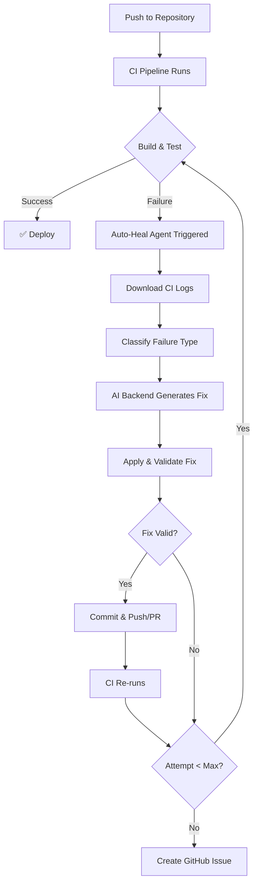

# Auto-Heal CI Agent

[](LICENSE)
[](package.json)
[](https://github.com/sidlabs-platform/Auto-Heal-CI-Agent/actions)

> **Automatically diagnose and fix CI/CD pipeline failures using AI — No manual intervention required.**

A **platform-agnostic, self-healing CI/CD agent** that automatically diagnoses and fixes pipeline failures using AI. Supports **GitHub Copilot coding agent**, **Copilot CLI (via GitHub Models API)**, and **direct LLM API calls** (OpenAI, Anthropic, Azure OpenAI, GitHub Models).

### Why Auto-Heal CI Agent?

- **Zero Downtime**: Automatically fixes common CI failures (lint errors, test failures, build issues) in seconds
- **Platform Agnostic**: Works with GitHub Actions, Azure DevOps, GitLab CI, or any CI platform
- **Multiple AI Backends**: Choose between Copilot Agent, Copilot CLI, or direct LLM API calls
- **Safe & Controlled**: Built-in safety mechanisms, file sandboxing, and kill switches
- **Production Ready**: Includes audit trails, max retry limits, and fallback to human review

---

## How It Works



**The healing process in 4 steps:**

1. **Detect**: CI pipeline fails → logs are uploaded as artifacts
2. **Diagnose**: Handler chain classifies the failure (lint/test/build/dependency)
3. **Fix**: AI backend (Copilot/LLM) generates and applies a fix
4. **Verify**: Changes are committed, CI re-runs automatically (up to 3 attempts)

If healing fails after max attempts, a GitHub Issue is created for manual review.

### Architecture Overview

| Component | Location | Purpose |
|-----------|----------|---------|
| Engine | `engine/` | Core pipeline: config → diagnose → fix → commit |
| Handlers | `handlers/node/` | Node.js failure classifiers (lint, test, build, dependency) |
| AI Backends | `backends/` | `copilot-agent`, `copilot-cli`, `llm-api` |
| CI Adapters | `adapters/` | GitHub Actions, Azure DevOps, GitLab CI, generic shell |
| Prompt Templates | `prompts/` | AI prompt templates for diagnosis and fix |
| Sample App | `src/` | Express REST API (Task Manager) with deliberate bugs |
| Tests | `tests/` | Jest + supertest test suite |
| Shell Scripts | `scripts/` | Legacy shell-based orchestrator (alternative to the engine) |

> See [ARCHITECTURE.md](ARCHITECTURE.md) for detailed system design and data flow diagrams.

---

## Quick Start

### 1. Use as a GitHub Action (Recommended)

The simplest way to add self-healing to your CI is via the composite GitHub Action. Add this to your workflow:

```yaml
# .github/workflows/ci.yml
name: CI Pipeline

on: [push, pull_request]

jobs:
  build-and-test:
    runs-on: ubuntu-latest
    steps:
      - uses: actions/checkout@v4
      - uses: actions/setup-node@v4
        with:
          node-version: '20'
      - run: npm ci

      - name: Lint
        run: npm run lint 2>&1 | tee ci-output.log

      - name: Test
        run: npm test 2>&1 | tee -a ci-output.log

      - name: Generate diagnostic JSON
        if: failure()
        run: |
          npm run lint:json || true
          npm run test:json || true

      - name: Upload CI artifacts
        if: failure()
        uses: actions/upload-artifact@v4
        with:
          name: ci-output
          path: |
            ci-output.log
            lint-output.json
            test-results.json

  auto-heal:
    needs: build-and-test
    if: failure()
    runs-on: ubuntu-latest
    permissions:
      contents: write
      pull-requests: write
      issues: write
    steps:
      - uses: actions/checkout@v4

      - name: Download CI log
        uses: actions/download-artifact@v4
        with:
          name: ci-output

      - name: Run Auto-Heal CI Agent
        uses: sidlabs-platform/Auto-Heal-CI-Agent@main
        with:
          backend: copilot-agent     # or copilot-cli, llm-api
          language: node
          log-file: ci-output.log
          commit-mode: pr            # or push, none
          max-attempts: 3
        env:
          GH_TOKEN: ${{ secrets.GH_PAT }}
```

### 2. Quick Setup Checklist

- [ ] Add the workflow above to `.github/workflows/ci.yml`
- [ ] Create a GitHub Personal Access Token (PAT) with `repo` scope
- [ ] Add the PAT as a repository secret named `GH_PAT`
- [ ] (Optional) Create `.heal-agent.yml` in your repo root to customize behavior
- [ ] Push a commit and watch the auto-healing in action!

### 3. Try it with the Demo App

This repository includes a sample Express app with intentional bugs to demonstrate the healing process:

```bash
# Clone the repository
git clone https://github.com/sidlabs-platform/Auto-Heal-CI-Agent.git
cd Auto-Heal-CI-Agent

# Install dependencies
npm install

# Run the tests (will fail due to deliberate bugs)
npm test

# Run the heal agent to fix the issues
npm run heal:diagnose  # Diagnose only (dry run)
npm run heal           # Diagnose and fix
```

---

### Action Inputs

| Input | Required | Default | Description |
|-------|----------|---------|-------------|
| `backend` | No | `copilot-agent` | AI backend: `copilot-agent`, `copilot-cli`, or `llm-api` |
| `language` | No | `node` | Language ecosystem: `node`, `python`, `go`, `dotnet` |
| `log-file` | No | `ci-output.log` | Path to the CI log file |
| `commit-mode` | No | `none` | How to deliver fixes: `push`, `pr`, or `none` |
| `attempt` | No | `1` | Current heal attempt number |
| `max-attempts` | No | `3` | Maximum number of heal attempts |
| `dry-run` | No | `false` | Diagnose only — do not apply fixes |
| `copilot-cli-model` | No | `gpt-4o` | Model for copilot-cli backend |
| `llm-provider` | No | — | LLM provider when using `llm-api` backend |
| `llm-model` | No | — | LLM model name when using `llm-api` backend |

### Action Outputs

| Output | Description |
|--------|-------------|
| `diagnosis-type` | Type of failure: `lint`, `test`, `build`, `dependency`, `unknown` |
| `healable` | Whether the failure is healable (`true`/`false`) |
| `fix-result` | Result of the fix attempt: `success` or `failure` |

---

## AI Backends

| Backend | Best For | How It Works |
|---------|----------|--------------|
| `copilot-agent` | GitHub repos | Creates a GitHub Issue with full diagnosis and assigns the Copilot coding agent — Copilot opens a PR with the fix |
| `copilot-cli` | GitHub repos (direct edits) | Calls the GitHub Models API with project context from `.github/agents/`, `.github/skills/`, and `.github/instructions/`, then writes file edits to disk |
| `llm-api` | Any CI platform | Calls OpenAI, Anthropic, Azure OpenAI, or GitHub Models API directly; parses code patches from the response |

### LLM API Provider Configuration

When using `backend: llm-api`, set one of these environment variables:

| Provider | API Key Env Var | Additional Config |
|----------|----------------|-------------------|
| OpenAI | `OPENAI_API_KEY` | — |
| Anthropic | `ANTHROPIC_API_KEY` | — |
| Azure OpenAI | `AZURE_OPENAI_API_KEY` | `AZURE_OPENAI_ENDPOINT` |
| GitHub Models | `GITHUB_MODELS_API_KEY` | — |

Fallback: `LLM_API_KEY` works for any provider.

---

## CI Platform Adapters

| Platform | Adapter | Path |
|----------|---------|------|
| GitHub Actions | Composite action | `adapters/github-actions/action.yml` (or root `action.yml`) |
| GitHub Actions | Reusable workflow | `adapters/github-actions/heal-reusable.yml` |
| Azure DevOps | Pipeline template | `adapters/azure-devops/heal-task.yml` |
| Generic (any CI) | Shell script | `adapters/generic/heal.sh` |

### Using on Any CI Platform

```bash
# Set your LLM API key
export OPENAI_API_KEY=sk-...

# Run the heal agent directly
node engine/index.js \
  --backend llm-api \
  --language node \
  --log-file ci.log \
  --commit-mode push \
  --verbose
```

Or use the generic shell adapter:

```bash
export HEAL_BACKEND=llm-api
export OPENAI_API_KEY=sk-...
bash adapters/generic/heal.sh --log-file ci.log --commit-mode pr
```

---

## Repository Configuration

Place a `.heal-agent.yml` in your repository root to customize behavior:

```yaml
backend: copilot-agent
language: node

llm:
  provider: openai
  model: gpt-4o

paths:
  allowed:
    - src/
    - tests/
  protected:
    - .github/
    - scripts/
    - .env

commands:
  lint: npm run lint
  test: npm test
  build: npm run build

max-attempts: 3
auto-merge: false
```

All settings can also be overridden via environment variables:

| Env Var | Description |
|---------|-------------|
| `HEAL_BACKEND` | Backend selection |
| `HEAL_LANGUAGE` | Language ecosystem |
| `HEAL_LLM_PROVIDER` | LLM provider name |
| `HEAL_LLM_MODEL` | LLM model name |

---

## CLI Reference

```
node engine/index.js [options]

Options:
  --backend <name>      copilot-agent, copilot-cli, llm-api
  --language <lang>     node (python, go, dotnet planned)
  --log-file <path>     Path to CI log file
  --repo-root <path>    Repository root (default: cwd)
  --attempt <n>         Current attempt number
  --max-attempts <n>    Maximum heal attempts (default: 3)
  --commit-mode <mode>  push, pr, or none
  --dry-run             Diagnose only — do not apply fixes
  --verbose             Detailed output
```

npm script shortcuts:

```bash
npm run heal              # Run engine with defaults
npm run heal:diagnose     # Diagnose only (dry run)
npm run heal:llm          # Run with llm-api backend
npm run heal:copilot      # Run with copilot-agent backend
```

---

## Prerequisites

| Requirement | Purpose |
|------------|---------|
| Node.js 20+ | Runtime for the engine and sample app |
| GitHub PAT (`GH_PAT`) | For `copilot-agent` and `copilot-cli` backends — needs `repo` scope |
| LLM API Key | For `llm-api` backend (OpenAI, Anthropic, etc.) |
| `ENABLE_SELF_HEAL` repo variable | Set to `false` to disable (kill switch) |

---

## Deliberate Failures (Demo)

This repo includes a sample Express app (`src/`) with intentional bugs for demonstration:

| File | Bug | Failure Type |
|------|-----|-------------|
| `src/app.js` | Uses `var` instead of `const` | ESLint `no-var` violation |
| `tests/edgeCases.test.js` | Wrong expected value (`2` instead of `1`) in `getStats` assertion | Jest test failure |

---

## Safety Mechanisms

| Mechanism | Description |
|-----------|-------------|
| **Max Retries** | Pipeline stops after configurable max heal attempts (default: 3) |
| **Kill Switch** | Set `ENABLE_SELF_HEAL=false` repo variable to disable instantly |
| **File Sandboxing** | Only `src/` and `tests/` files are staged for commit |
| **Protected Files** | Workflow, script, and config file changes are auto-reverted |
| **Pre-flight Checks** | `safety-guard.sh` validates environment before healing |
| **Audit Trail** | Every attempt logged in `.heal-audit/` with diagnosis and LLM output |
| **Concurrency Lock** | Only one heal pipeline runs per branch at a time |
| **Dry Run Mode** | Diagnose without applying changes (`--dry-run`) |

---

## Project Structure

```
├── action.yml                       # GitHub Action definition (composite)
├── engine/
│   ├── index.js                     # CLI entry point
│   ├── config.js                    # Config loader (.heal-agent.yml + env + defaults)
│   ├── diagnose.js                  # Diagnosis orchestrator (runs handler chain)
│   ├── fix.js                       # Backend factory (routes to AI backend)
│   └── commit.js                    # Git operations (stage, commit, push/PR)
├── handlers/
│   └── node/                        # Node.js failure handlers
│       ├── index.js                 # Handler chain (lint → test → build → dependency)
│       ├── lint.js                  # Parses ESLint JSON output
│       ├── test.js                  # Parses Jest JSON output
│       ├── build.js                 # Detects syntax/module/reference errors in logs
│       └── dependency.js            # Detects npm install/audit failures in logs
├── backends/
│   ├── copilot-agent.js             # Creates Issue + assigns Copilot coding agent
│   ├── copilot-cli.js               # Calls GitHub Models API with project context
│   └── llm-api.js                   # Direct LLM API calls (OpenAI/Anthropic/Azure/GitHub)
├── adapters/
│   ├── github-actions/
│   │   ├── action.yml               # Composite action adapter
│   │   └── heal-reusable.yml        # Reusable workflow adapter
│   ├── azure-devops/
│   │   └── heal-task.yml            # Azure DevOps pipeline template
│   └── generic/
│       └── heal.sh                  # Universal shell adapter (any CI)
├── prompts/
│   ├── heal-prompt.md               # Fix prompt template
│   └── diagnose-prompt.md           # Diagnosis prompt template
├── scripts/                         # Shell-based orchestrator (legacy alternative)
│   ├── heal.sh                      # Main shell orchestrator
│   ├── safety-guard.sh              # Pre-flight safety checks
│   ├── validate-changes.sh          # Post-heal file validation
│   ├── handlers/                    # Shell failure classifiers
│   └── prompts/                     # Shell prompt templates
├── .github/
│   ├── agents/auto-healer.md        # Copilot agent persona
│   ├── copilot-instructions.md      # Repo-wide Copilot instructions
│   ├── instructions/                # Path-specific Copilot instructions
│   ├── skills/ci-healing/SKILL.md   # CI healing domain knowledge
│   └── workflows/
│       ├── ci.yml                   # Main CI pipeline (3-job: build → heal → fallback)
│       └── heal-reusable.yml        # Reusable workflow for external repos
├── src/                             # Sample Express app (Task Manager)
│   ├── app.js                       # Express app setup
│   ├── server.js                    # HTTP server entry
│   ├── models/taskStore.js          # In-memory data store
│   ├── routes/tasks.js              # REST API routes
│   └── services/taskService.js      # Business logic & validation
├── tests/                           # Jest + supertest test suite
│   ├── routes.test.js               # API integration tests
│   ├── taskService.test.js          # Service unit tests
│   └── edgeCases.test.js            # Edge case tests
└── package.json
```

---

## Documentation

| Guide | Description |
|-------|-------------|
| [HEAL-AGENT.md](HEAL-AGENT.md) | Detailed engine documentation, backend configs, adapter usage |
| [ARCHITECTURE.md](ARCHITECTURE.md) | System design, data flow, component interactions |
| [SETUP-GUIDE.md](SETUP-GUIDE.md) | Step-by-step setup for automated operation |
| [EXTENDING.md](EXTENDING.md) | How to add new failure handlers, languages, and backends |
| [CONTRIBUTING.md](CONTRIBUTING.md) | Contribution guidelines |

---

## Sample App Commands

```bash
npm start           # Start Express server on port 3000
npm test            # Run Jest test suite
npm run lint        # Run ESLint
npm run build       # Validate syntax (build check)
npm run test:json   # Tests with JSON output (for handlers)
npm run lint:json   # ESLint with JSON output (for handlers)
```

---

## Troubleshooting

### Common Issues

#### Agent Not Triggering

**Problem**: Auto-heal job doesn't run after CI failure

**Solutions**:
- Verify `ENABLE_SELF_HEAL` repository variable is not set to `false`
- Check that the `auto-heal` job has proper permissions (contents: write, pull-requests: write, issues: write)
- Ensure the `needs: build-and-test` dependency is correct
- Verify `if: failure()` condition is present

#### Authentication Failures

**Problem**: "Authentication failed" or "403 Forbidden" errors

**Solutions**:
- For `copilot-agent` or `copilot-cli`: Verify `GH_PAT` secret exists and has `repo` scope
- For `llm-api`: Check that the appropriate API key environment variable is set (e.g., `OPENAI_API_KEY`)
- Ensure the PAT hasn't expired
- For GHES: Set `gh-host` input parameter to your GHES hostname

#### Fixes Not Being Applied

**Problem**: Agent diagnoses the issue but doesn't apply fixes

**Solutions**:
- Check `commit-mode` is set to `push` or `pr` (not `none`)
- Verify protected files aren't blocking the fix (check `.heal-agent.yml` `paths.protected`)
- Review `.heal-audit/` logs for detailed error messages
- Ensure the backend has sufficient context to generate a valid fix

#### Infinite Healing Loops

**Problem**: Agent keeps trying to fix the same issue

**Solutions**:
- Check `max-attempts` is set appropriately (default: 3)
- Review the fix logic in `.heal-audit/` to identify why fixes aren't working
- Consider adding the problematic path to `paths.protected` temporarily
- Use `dry-run: true` to diagnose without applying changes

---

## FAQ

### General Questions

**Q: Is this production-ready?**

A: Yes, with proper configuration. Use `max-attempts: 3`, enable `paths.protected`, and start with `commit-mode: pr` for review before auto-merging.

**Q: Which AI backend should I use?**

A:
- **copilot-agent**: Best for GitHub repos, creates Issues + PRs via Copilot
- **copilot-cli**: Direct file edits using GitHub Models API with project context
- **llm-api**: Most flexible, works with any LLM provider and CI platform

**Q: Does this work with private repositories?**

A: Yes, it works with both public and private repositories. Ensure your PAT has access to the private repo.

**Q: What languages are supported?**

A: Currently optimized for Node.js. Python, Go, and .NET support is planned. The generic shell adapter works with any language.

### Security & Safety

**Q: Is it safe to let AI modify my code?**

A: The agent includes multiple safety mechanisms:
- File sandboxing (only modifies allowed paths)
- Protected file list (never modifies critical files)
- Max retry limits
- Audit trail for every change
- Kill switch via `ENABLE_SELF_HEAL` variable
- Start with `commit-mode: pr` for manual review

**Q: Can I disable auto-healing temporarily?**

A: Yes, set the `ENABLE_SELF_HEAL` repository variable to `false`. This acts as a kill switch without modifying your workflow files.

**Q: What happens if the agent makes a bad fix?**

A:
1. The CI will fail again on the next attempt
2. After `max-attempts` (default: 3), the agent stops and creates a GitHub Issue for manual review
3. All changes are logged in `.heal-audit/` for debugging

### Cost & Usage

**Q: How much does this cost?**

A: Costs depend on the backend:
- **copilot-agent**: Included with GitHub Copilot subscription
- **copilot-cli**: Uses GitHub Models API (pricing varies by model)
- **llm-api**: Direct API costs from your LLM provider

**Q: How can I reduce API costs?**

A:
- Set reasonable `max-attempts` (3 is recommended)
- Use smaller models for simple fixes (e.g., GPT-4o-mini)
- Enable the kill switch during development/testing
- Use `dry-run: true` for testing without applying fixes

### Integration

**Q: Can I use this with Azure DevOps / GitLab CI?**

A: Yes! Use the generic shell adapter (`adapters/generic/heal.sh`) or platform-specific templates in `adapters/`.

**Q: Can I customize the healing logic?**

A: Yes, see [EXTENDING.md](EXTENDING.md) for:
- Adding new failure handlers
- Creating custom backends
- Modifying prompt templates
- Adding language support

**Q: How do I test this before using in production?**

A:
1. Clone this repo and run the demo app (`npm test`, then `npm run heal`)
2. Use `dry-run: true` to diagnose without applying fixes
3. Start with `commit-mode: pr` to manually review all changes
4. Test on a non-critical branch or repository first

---

## License

MIT


